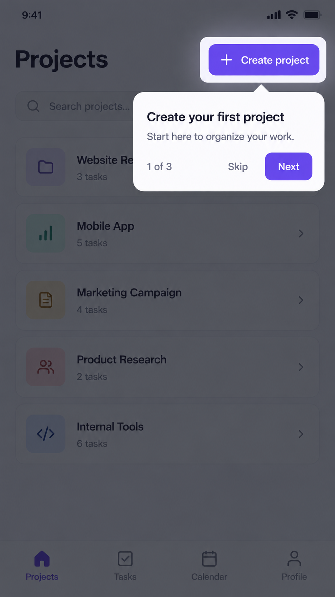
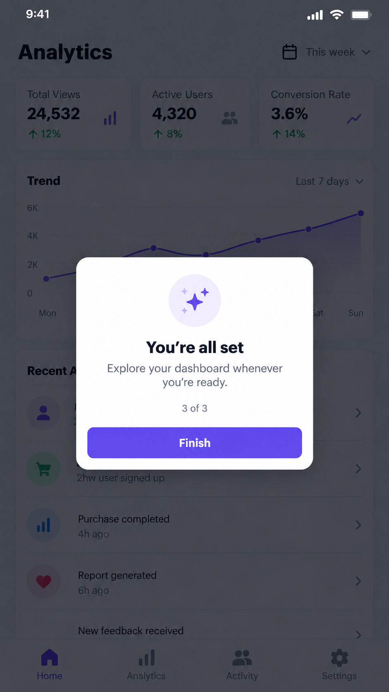

# react-native-tourly

[](https://www.npmjs.com/package/react-native-tourly)
[](./LICENSE)

**react-native-tourly** is a lightweight, controlled guided-tour and onboarding library for React Native. Highlight real UI elements, explain features in context, and keep progress fully owned by your app.

## Author

Created and maintained by [Fazalur Rahman](https://www.linkedin.com/in/fazalur-rahman-43637b1b3/) · [GitHub @fazalur076](https://github.com/fazalur076)

## Highlights

- Spotlight any measured `TourTarget`
- Keep tour state in your own React state, store, or persistence layer
- Position tooltips automatically, above, below, or in the centre
- Let users interact with the highlighted target and optionally advance on tap
- Handle targets that render late with `wait`, `skip`, or `show` behaviour
- Replace the tooltip UI or tune the built-in theme

## In action

<p align="center">
  
  
</p>

## Install

```sh
pnpm add react-native-tourly
# or
npm install react-native-tourly
```

`react` (18+) and `react-native` (0.72+) are peer dependencies.

## Integrate react-native-tourly

There are three pieces:

1. Put `TourProvider` around the screen or app area that owns the tour.
2. Wrap each highlightable UI element in `TourTarget` with a stable ID.
3. Render one controlled `TourOverlay` and own its `visible` and `activeStepIndex` state.

```tsx
import { useState } from 'react'
import { Button, View } from 'react-native'
import {
  TourOverlay,
  TourProvider,
  TourTarget,
  type TourStep,
} from 'react-native-tourly'

const steps: TourStep[] = [
  {
    id: 'create-project',
    title: 'Create a project',
    body: 'Start a new project from this button.',
    targetId: 'create-project',
    placement: 'bottom',
    allowTargetInteraction: true,
    advanceOnTargetPress: true,
  },
  {
    id: 'complete',
    title: 'You are ready',
    body: 'Use the menu whenever you need help.',
  },
]

export function ProjectsScreen() {
  const [visible, setVisible] = useState(false)
  const [activeStepIndex, setActiveStepIndex] = useState(0)

  function startTour() {
    setActiveStepIndex(0)
    setVisible(true)
  }

  return (
    <TourProvider>
      <View style={{ flex: 1 }}>
        <TourTarget id="create-project">
          <Button title="Create project" onPress={() => {}} />
        </TourTarget>

        <Button title="Show me around" onPress={startTour} />

        <TourOverlay
          visible={visible}
          steps={steps}
          activeStepIndex={activeStepIndex}
          onStepChange={setActiveStepIndex}
          onFinish={() => setVisible(false)}
        />
      </View>
    </TourProvider>
  )
}
```

### Persist completion (optional)

Because react-native-tourly is controlled, persisting a completed tour is ordinary app state. For example, read a value from AsyncStorage before rendering and save it from `onFinish`. When it is complete, render the overlay with `visible={false}`.

## API

### `TourProvider`

Required once above every `TourTarget` and `TourOverlay` that participate in the same tour.

### `TourTarget`

A `View` wrapper that registers an element by `id` and measures it when its corresponding tour step is active. Use stable IDs that match a step’s `targetId`.

### `TourOverlay`

A controlled overlay. Provide `visible`, `steps`, and `activeStepIndex`; update the index in `onStepChange`; close the tour and persist its completion in `onFinish`.

### `TourStep`

| Field | Purpose |
| --- | --- |
| `id`, `title`, `body` | Required step identity and copy. |
| `targetId` | Matches a `TourTarget` ID. Omit it for a centred, target-free step. |
| `placement` | `top`, `bottom`, `center`, or `auto` (default). |
| `missingTargetBehavior` | `wait`, `skip`, or `show` (default) if a target has not mounted yet. |
| `allowTargetInteraction` | Allows taps through the spotlight to the highlighted control. |
| `advanceOnTargetPress` | Moves to the next step after the highlighted target is tapped. |
| `targetWaitMs` | Overrides how long `wait` waits for a target to mount. |

### Custom appearance

Use `theme` to override built-in colours and shape tokens. Pass `renderTooltip` for complete control over the card; it receives the current `step`, `index`, `total`, `targetFound`, and `onBack`, `onNext`, and `onFinish` actions.

## Development

```sh
pnpm install
pnpm typecheck
pnpm test
pnpm build
```

## License

Released under the [MIT License](./LICENSE).
